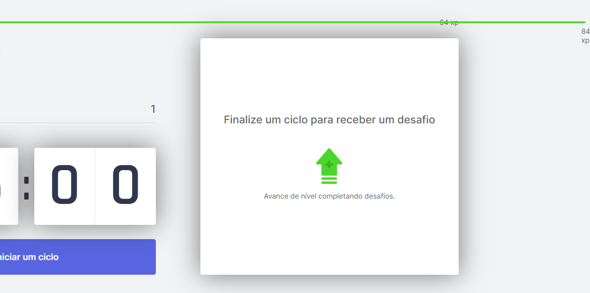

# Erros Corrigidos

Este documento contém a descrição das correções dos principais erros detectados.  

## Erro na atualização da "ExperienceBar"

Conforme a utilização do programa, foi descoberto o seguinte erro:

### Análise do Erro

Após o estudo do erro e suas possíveis causas, foi descoberto que ele era origina-se do sistema permitir que a soma da pontuação do desafio proposto mais os pontos acumualdos pelo usuário no momento permitam o usuário avançar mais de um "level" ao completar o desafio, fazendo com que a tela mostre a barra de experiência para o "level" seguinte após a conclusão do desafio completa, existindo a possibilidade da barra exceder o tamanho de visualização da tela.

### Correção

A correção foi aplicada nos seguintes passos:

1. Calcula-se a pontuação necessária para o usuário atingir dois "levels" acima do que ele está no momento;
2. Caso a soma dos pontos do desafio proposto mais a pontuação do usuário seja maior ou igual ao valor obtido no passo anterior, a pontuação do desafio será determinada conforme a fórmula abaixo:

P = N + R

Onde:

P: Pontuação do desafio proposto;  
N: Pontuação necessária para o próximo "level";  
R: Resto da divisão inteira da pontuação original do desafio proposto com N.  

### Dados do commit com a aplicação da correção:

Data e Hora: 15/04/21 22:16:30 (Horário de Brasília)  
Mensagem: "Correcao de erro de exibicao da ExperienceBar".

