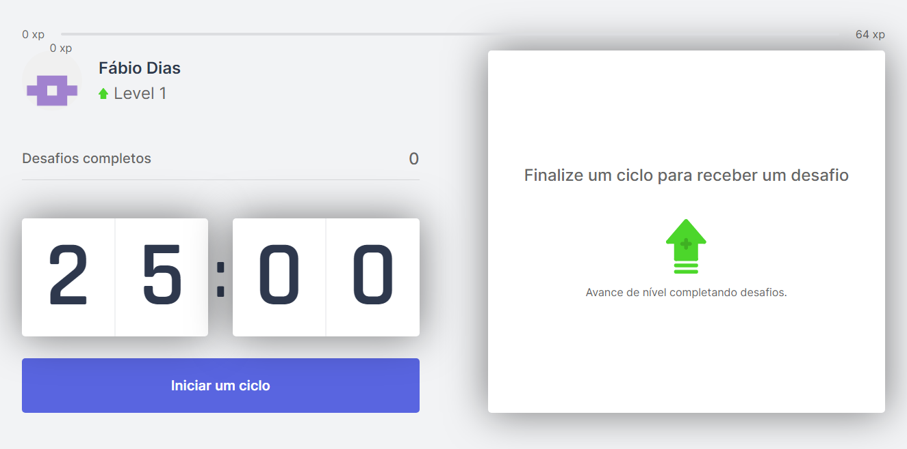
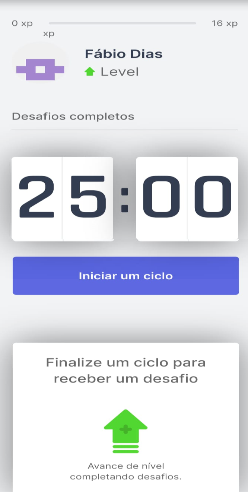
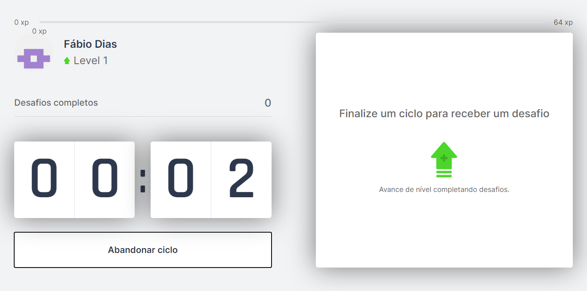
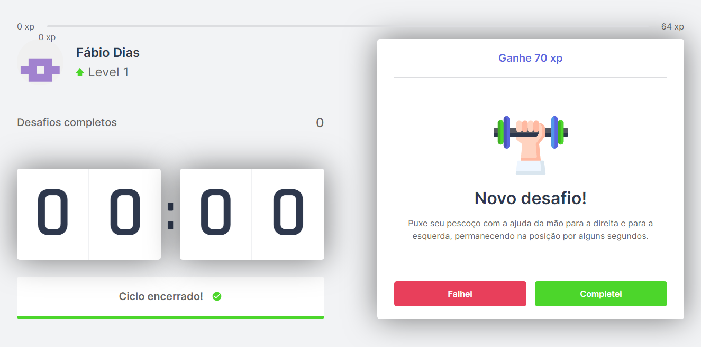
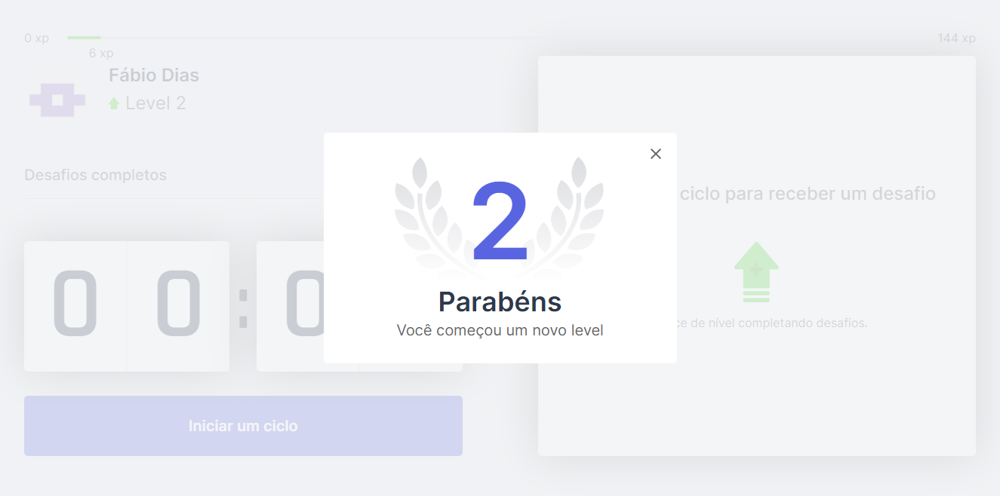
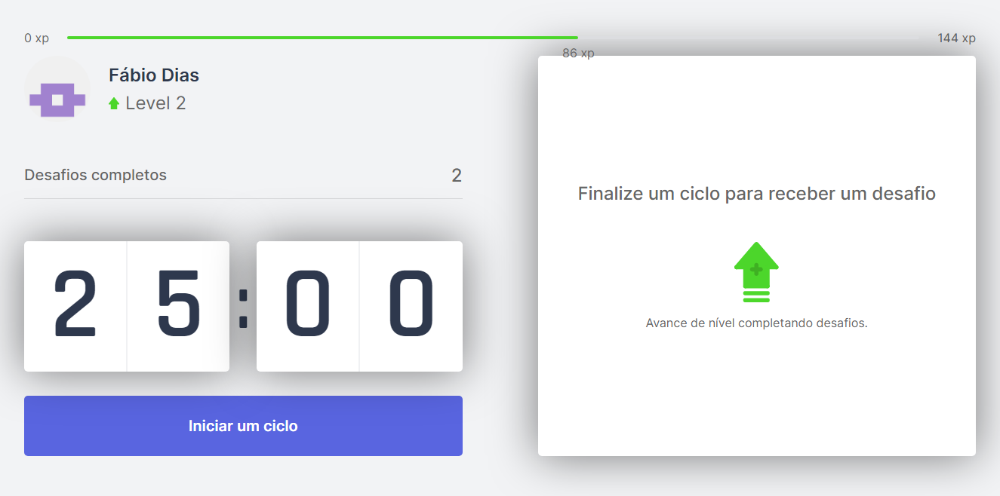

# Projeto Move it

##  Introdução

Este repositório contém o projeto ‘Move It’, desenvolvido na Next Level Week 4. Evento promovido pela [Rocketseat](https://rocketseat.com.br/).

## Ideia do projeto

O intuito deste projeto é fazer o usuário utilizar uma variação da técnica de Pomodoro, que orienta o usuário a dividir uma atividade em intervalos de 30 minutos. Para cada intervalo, o usuário emprega 25 minutos na realização da atividade e 5 minutos de descanso.
O projeto indica para o usuário no período de descanso alguma atividade física simples voltada para o corpo, dentre elas algumas específicas para os olhos.

O sistema usa alguns conceitos de jogos digitais, onde o usuário vai acumulando pontos e avança conforme os exercícios que ele realiza.

## Stakeholders/Usuários

Pessoas que usam o computador para trabalhar e/ou estudar.

## Funcionalidades

- Cronometragem de 25 minutos;
- Sugestão de exercícios físicos, desafios;
- Contabilização de pontos.

## Tecnologias Utilizadas

 - React com NextJs.

## Requisitos de instalação/desenvolvimento.

- Node versão 12 ou superior

## Telas

Início

*Versão Desktop*

*Versão Mobile*

Contagem regressiva iniciada

Exibição do desafio

Avanço de level

Tela atualizada com a contagem de pontos

## Como usar

O usuário acessa o sistema por meio de um navegador web, clica no botão “Iniciar um ciclo"  no momento que começar uma atividade, o sistema começará a cronometrar os 25 minutos. Após os 25 minutos o sistema emitirá uma notificação e mostrará uma sugestão de um exercício, desafio, para o corpo ou para os olhos, caso o usuário realize o desafio ele ganha pontos. Conforme o usuário acumula pontos, ele aumenta seu level.  

*Observações*

1. O sistema só emitirá uma notificação para o usuário no caso dele conceder-lhe a devida permissão de uso dos recursos do sistema;

2. Caso o usuário não consiga completar o ciclo, isto é, não consiga empregar 25 minutos integralmente para realização de uma tarefa, ele tem a opção de abandonar o ciclo.  

## Cálculo da pontuação

Cada desafio proposto possui uma quantidade de pontos. Esses pontos são acumulados pelo usuário.  
Conforme o usuário usa o software, ele aumenta de "level". Sendo que cada "level" possui uma quantidade mínima de pontos que o usuário precisa obter para atingi-lo.  
Os pontos dos "levels" são calculados conforme a fórmula abaixo:  

N = [(L + 1) x 4] ²

Onde:

L: Número inteiro positivo  do "level" atual do usuário (começa do zero);  
N: Pontos necessários para subir de "level".

*Observação*

No caso da pontuação do desafio proposto somada com os pontos acumulados pelo usuário possibilitar que o usuário avance mais de um "level" ao concluir o desafio, a pontuação desse desafio será alterada conforme a fórmula abaixo:  

P = N + R

Onde:

P: Pontuação do desafio proposto;  
N: Pontuação necessária para o próximo "level";  
R: Resto da divisão inteira da pontuação original do desafio proposto com N.

## Agradecimentos

Segue o agradecimento a toda a comunidade de devs que participou do evento e membros da Rocketseat, em especial ao professor [Diego Fernandes](https://www.youtube.com/channel/UC_2bfnGwgK7qdI_F0CzCgpg).

